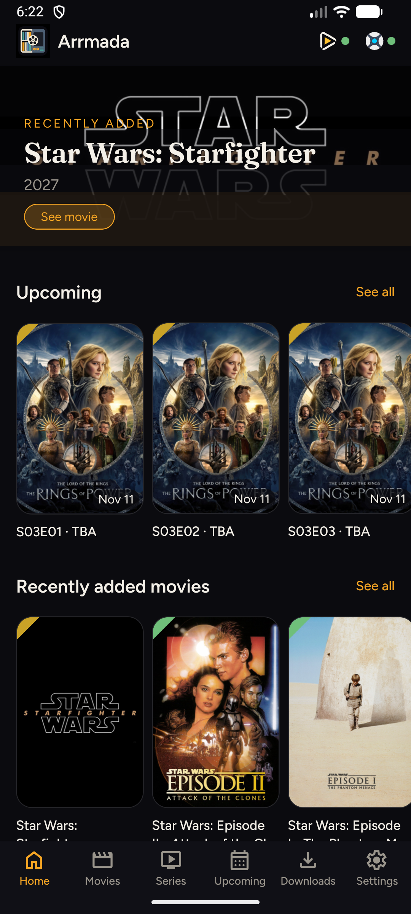
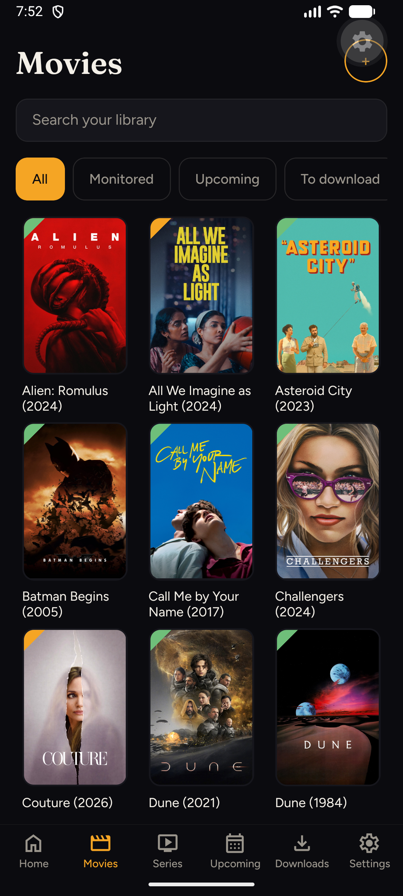
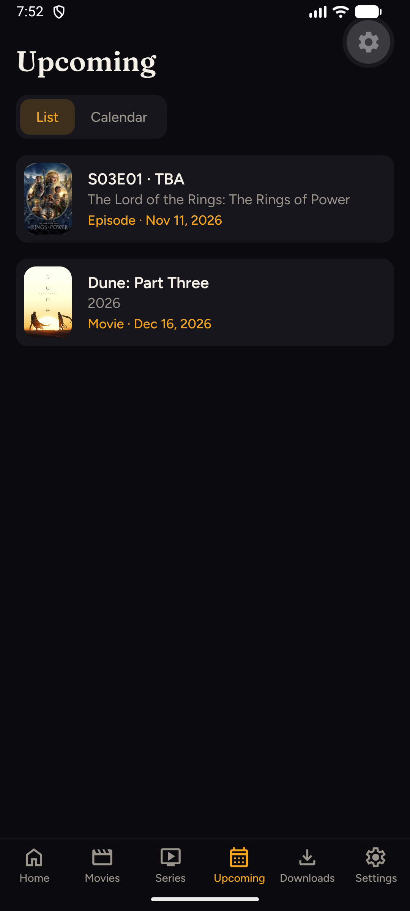
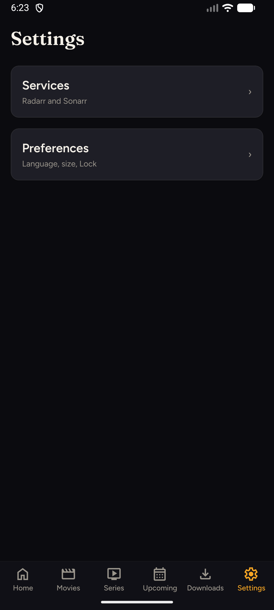

<p align="center">
  
</p>

<h1 align="center">Arrmada</h1>

<p align="center">
  <strong>Your Radarr &amp; Sonarr libraries, on your phone — home LAN only.</strong>
</p>

<p align="center">
  Android-first Expo app for a non-technical home user: browse Movies and Series,
  add titles, follow releases, and control Downloads — talking
  <em>directly</em> to one Radarr and one Sonarr on your Wi‑Fi.
  UI language follows the phone (<code>fr*</code> → French, otherwise English),
  with an override in Settings → Preferences.
</p>

<p align="center">
  
  
  
  
</p>

---

## Screenshots

English UI on an Android emulator against live Radarr/Sonarr (language override: Settings → Preferences).

<p align="center">
  
  
  
  
</p>
<p align="center">
  <sub>Home · Movies · Upcoming · Settings</sub>
</p>

---

## Features

- **Home** — cinematic overview: downloads in progress, recent library activity, health, and a short Upcoming preview
- **Movies & Series** — poster grids with search and filters (Monitored, Upcoming, To download, Downloaded)
- **MediaQuick** — glanceable bottom sheet from a poster; one tap to open the full detail
- **Details** — metadata, synopsis, monitor toggle, Download / Remove; Series organized by season and episode
- **Add** — search and add with silent server defaults (no quality/folder pickers in the normal flow)
- **Upcoming** — date-sorted list or calendar (same data, two layouts)
- **Downloads** — Pause / Resume and Cancel
- **Notifications** — local alerts when a download starts, becomes available, or fails
- **Lock** — optional PIN / biometrics (off by default)
- **Settings** — hub: **Services** (address + access key) and **Preferences** (language, interface size, Lock)

### Out of scope

Not a Radarr/Sonarr UI clone: no indexer browsers, custom formats, or remote-access UX. The phone and the \*arr servers must be on the **same LAN** (or reachable as if they were).

---

## Requirements

- **Node.js 20+**
- **Android** device or emulator with [Expo Go](https://expo.dev/go) (or a dev build)
- Phone and servers on the **same home LAN**
- One **Radarr** (Films) and one **Sonarr** (Séries) instance

---

## Getting started

```bash
npm install
npm start
```

Scan the QR code with Expo Go, or press `a` for the Android emulator.

### Self-build with a preconfigured `.env`

For a personal LAN build you can skip onboarding by copying [`.env.example`](.env.example) to `.env` and filling all four values:

```bash
cp .env.example .env
# edit EXPO_PUBLIC_RADARR_* and EXPO_PUBLIC_SONARR_*
npm start
```

| Variable                         | Purpose                          |
| -------------------------------- | -------------------------------- |
| `EXPO_PUBLIC_RADARR_URL`         | Radarr base URL (LAN IP + port)  |
| `EXPO_PUBLIC_RADARR_API_KEY`     | Radarr API key (read/write)      |
| `EXPO_PUBLIC_SONARR_URL`         | Sonarr base URL (LAN IP + port)  |
| `EXPO_PUBLIC_SONARR_API_KEY`     | Sonarr API key (read/write)      |

All four are required for the seed to run; leave them unset (or omit `.env`) to use onboarding instead.  
On first launch Arrmada seeds Secure Store from that env and opens the app.  
`EXPO_PUBLIC_*` values are **inlined into the JS bundle** — fine for your own phone/APK, not for distributing secrets. `.env` is gitignored; commit only `.env.example`.

### LAN & HTTP

Arrmada talks **directly** to Radarr/Sonarr. Use each service’s LAN IP and port, for example:

| Service | Typical URL                |
| ------- | -------------------------- |
| Radarr  | `http://192.168.1.10:7878` |
| Sonarr  | `http://192.168.1.10:8989` |

Cleartext HTTP is allowed for local addresses so you do not need TLS on the home LAN.

---

## Connect Radarr & Sonarr

On first launch you get onboarding (**Connect Radarr and Sonarr**). You can change the same fields later under **Settings → Services**.

### API keys

Create a **read/write** API key in each service:

**Radarr**

1. Open Radarr → **Settings** → **General**
2. Under **Security**, copy or generate an **API Key**
3. Paste it into Arrmada (Access key)

**Sonarr**

1. Open Sonarr → **Settings** → **General**
2. Under **Security**, copy or generate an **API Key**
3. Paste it into Arrmada (Access key)

Tap **Test connection**, then **Continue**.

Keys stay on the device (Expo Secure Store) and are never written to logs.

---

## App map

| Tab           | What it’s for                                                                  |
| ------------- | ------------------------------------------------------------------------------ |
| **Home**      | Day-to-day glance: downloads in progress, recent titles, health, upcoming peek |
| **Movies**    | Movie library, search, filters, Add                                            |
| **Series**    | Series library, seasons & episodes                                             |
| **Upcoming**  | Upcoming releases — list ↔ calendar                                            |
| **Downloads** | Active / queued downloads and controls                                         |
| **Settings**  | Hub → Services (addresses/keys) · Preferences (language, size, Lock)           |

---

## Development

| Command             | Description                           |
| ------------------- | ------------------------------------- |
| `npm start`         | Expo dev server                       |
| `npm run android`   | Open on Android                       |
| `npm run typecheck` | TypeScript `--noEmit`                 |
| `npm test`          | Jest unit tests                       |
| `npm run test:ci`   | Jest CI mode (hooks + GitHub Actions) |

Git hooks (typecheck on commit, tests on push) enable after `npm install`. See [`docs/agents/ci-and-hooks.md`](docs/agents/ci-and-hooks.md).

### Layout

| Path              | Role                                              |
| ----------------- | ------------------------------------------------- |
| `app/`            | Expo Router screens (tabs, fiches, onboarding)    |
| `src/arr-client/` | Pure Radarr/Sonarr HTTP + domain (no React)       |
| `src/features/`   | Feature modules (MediaQuick, upcoming, verrou, …) |
| `src/components/` | Shared UI                                         |
| `docs/decisions/` | ADRs                                              |
| `CONTEXT.md`      | Product language (Film, Suivi, À venir, …)        |

### Docs worth reading

- Product language: [`CONTEXT.md`](CONTEXT.md)
- Architecture decisions: [`docs/decisions/`](docs/decisions/)
- Specs & plans: [`docs/superpowers/`](docs/superpowers/)
- Agent / CI notes: [`docs/agents/`](docs/agents/)

### Manual smoke checklist

- [ ] Fresh install → onboarding with empty connection cards
- [ ] Test connection success / fail (Ready vs error + retry)
- [ ] Browse Movies / Series — grids, search, filters
- [ ] MediaQuick → Movie / Series detail
- [ ] Add a title → appears in library / Downloads as expected
- [ ] Downloads — Pause / Resume / Cancel
- [ ] Upcoming — switch list ↔ calendar
- [ ] Kill Radarr only → Movies error, Series still works
- [ ] Settings — keys masked; Lock optional path works

---

## License

[MIT](LICENSE) © [R0binT](https://github.com/R0binT)
